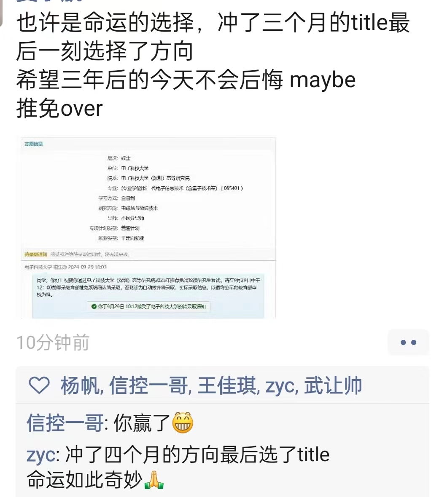
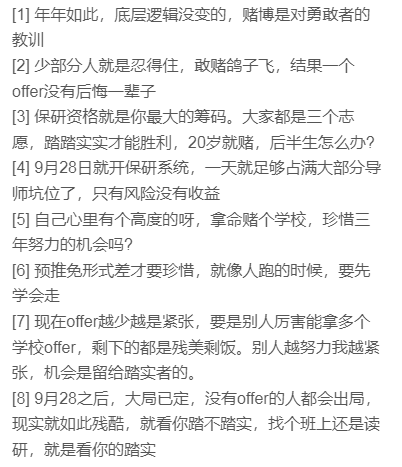

- [写在前面的话](#写在前面的话)
- [故事从哪说起](#故事从哪说起)
- [人生是旷野，这是建议而非指南](#人生是旷野这是建议而非指南)
  - [关于我](#关于我)
  - [随便聊聊](#随便聊聊)
  - [什么最重要？](#什么最重要)
  - [提前规划](#提前规划)
  - [关于我的gap year](#关于我的gap-year)

## 写在前面的话
我成功的经验不多，失败的经验倒是不少。  
整体是记流水账的形式，文笔很差见谅，我只能尽可能详尽叙述，希望对你有一点帮助。  
[一些保研术语](https://zhuanlan.zhihu.com/p/684966740)——不懂的词汇请查词典。  
`This is a gaze backward for me, not a guide forward for you`这句话我想了很久，也适合这里。

## 故事从哪说起
区分一下，大概涉及到五所学校以及五位导师。分别命名为学校A/B/C/D/E以及对应的老师A/B/C/D/E。  

四月份的时候，我还不是特别明确自己想做什么，控制/计算机视觉/深度学习/高性能计算，这些方向其实都有考虑过。事情在做了之后逐渐变得明确。

---  
**Time：4.20 - 7.10**   

`4.20` 做好了简历，几封套磁信正式拉开了保研的序幕。  
  
发了邮件后，老师大多都有回复，提到后续可以报名夏令营。  
期间联系到了老师A，可能因为是新老师，给了特别积极的回复。加了微信，约了一个腾讯会议聊了聊，我以为会有个面试啥的，我焦虑而激动地复习了项目。没想到老师先用PPT介绍了一下自己。简单聊了聊，准备后续报名夏令营。  
                  
`6.20-7.10` 大部分夏令营都开了，把末九、中九夏令营都投了一遍，意料之中的夏0营。   
不出意料的没入梦校A的夏令营，老师A让我预推免再报，预推免的机会更大。结合往年的情况，我感觉预推免的问题应该不大。

---

**Time：7.11 - 8.2** 

在家线上拿了一个学校B的保底offer，当时虽然没有其他offer，不认为自己会去学校B，因此也没有联系老师。  
除了一个自我介绍PPT，这段时间没有做其他保研相关的事情。大部分时间在做项目，看论文（我确实觉得这是很有意思的事情。至于对保研有什么用，我不知道）。

---

**Time：8.3 - 8.27**  
  
在家闲着没事干，等待学校A的预推免，当时也没有夏令营和预推免的报名工作。因此联系了学校C方向比较match的导师C，导师C要求考核，内容是论文汇报以及复现尝试。我想闲着也是闲着，不如学点东西，于是以学习的心态做了二十多天考核。  

这场考核把我熬干了。第一次是邮件联系的老师，给了一篇论文，要求给出阅读报告。我花了四天大概看的大差不差，记录了一些认识和疑问，发了过去。老师回信，加了微信语音聊了十分钟，让我和博士继续做一段时间，我答应下来。我、老师、博士拉了一个的群。博士一下发了某个领域最新的六篇顶会，让我看看并复现，十天后和他交流。
这十天的进步伴随着痛苦，缺少太多前置知识了，真的会有想要“干呕”的生理不适，最后还是熬下来了。
后面又针对一篇论文深入学习了七天。收获还是很大的，确实锻炼了很多阅读论文的能力。

`8.27` 老师C说暂时把名额留给我。   

后面了解到其他做导师C考核的人，没有做到我这个程度，也给了名额。多说一句，保研中的考核要慎重。

--- 

**Time：8.28 - 9.2**   

学校A预推免开了，我一半是真想直博，一半是想让老师捞我，于是和梦导A提出来直博，老师要求论文讲解+项目介绍。三天时间内精读了论文并准备PPT的介绍。  
`9.2`在腾讯会议聊了半个小时。  
老师就是直博的，可能淋过雨，他也见过别人淋雨，再加上我没有paper，因此老师建议我先上硕士，因为研一研二都可以转博，同时我也不是百分之百的坚定直博，因此决定先报专硕。

老师的判断是：报专硕进课题组应该没问题。    
结合往年的情况，我的判断是：应该没什么问题。  

--- 
**Time：9.3 - 9.14**   

报了学校A的预推免，等结果。  
梦导A在我心里优先级无限高，而且我觉得进了面试，应该没什么问题。因此其他老师一个没联系，其他学校的预推免也没基本没报。  
`9.8` 导师C要求我两天内确认是否去学校C，确认了就一定要来，我与导师A沟通，他再次传递出加入他课题组问题不大的意思。我不想后面再鸽导师C，因此直接拒了导师C。  
    
`9.14` 刷到了别人的小红书——已经进入了学校A的复试。 
被默拒了啊，我去问导师A “能捞一下我吗？”——“我也没有办法捞~”  
很难描述当时的心情，感觉自己碎了。

--- 
**Time：9.15 - 9.19**   

真慌了，也看不到什么希望，只能每天给自己做心理工作，去B也不错。  
把还开着的预推免全报了一遍。是一场徒劳而顽强的挣扎。整个过程进的唯一一个复试，300进面发0个offer，面得再好也是候补。 

当时感觉自己大概率要去学校B了，因此先联系了老师，到时候能有一个满意的方向和老师。和老师B约了一场面试。特别棒的面试体验。她是真的想了解我做的事情。虽然老师没有接触过我做的事情，但老师会从她的现有知识进行推断，也会提出来她的疑问。前所未有地感觉到了老师的真诚！老师也特别有水平！  
面试结束了，很认真的考虑了老师B。看了老师的论文——可惜老师的方向我不算特别喜欢。

---
**Time：9.19 - 9.20**   

`9.19` 海投中联系到了导师D，约定了明天的面试。  
`9.20 14.30` 进到腾讯会议的时候就被压力到了，对面的阵容应该是两个博士+两个老师。十二分钟的PPT项目介绍，我的项目中有较大一部分和老师课题组中的研究内容相关，因此问的特别细致。总共面了半个小时。整体来说是压力最大的一场面试，有点被拷打到了。面试快结束导师D不痛不痒的给我介绍预推免的流程——感觉寄啦！  
`9.20 17.00` 收到导师D的邮件——经过组内商讨，正式邀请我加入课题组，并要求尽快回复以便预留名额。我立马表示了确定去的意向，woc，拿到了？这个时间点还能有名额？人是飘飘然的。  

---
**Time：9.21 - 9.27**   

这是起起伏伏的五天。  
`9.21` 收到梦导D的邮件，询问了我的毕设安排，给了我一些学习路线，约我一周后聊一聊研究方向，甚至顺便给了我英语学习的建议。woc，这是真想要我啊，又确认了学校D是弱com（导师也说可以推荐我进面试），感觉稳了。  
`9.22-9.24` 详细看了导师D的近两年的论文，感觉自己明天就是研究生了，时刻准备进组。  
`9.25` 早上给老师D发了邮件，询问讨论前我还需要做哪些准备。上午刷到群友讨论学校D招生名额出了问题，且某9学生被导师D同组的另一位导师鸽了（上周那位导师说有名额，这周就没有名额了），又加之我的导师C一直没回复我的邮件，我想—寄了。真把我被鸽了？但没有这样鸽学生的，不可能搞默拒的。没看邮件？以往都是秒回的。为什么不回呢？不知道——等。  
晚上十点半，导师D回复了我的邮件，提到——面试的时候，我可以明确指出“我已经被老师录取”，又继续和我讨论了研究方向。我悬着的心放下了，应该不会出什么问题了吧。也立马要求加了微信，不想再这样无意义的内耗和等待了。  
`9.26` 学校D线上面试，我一进腾讯会议，面试比较走流程。面完觉得真稳了。等928填系统就行。  
`9.27` 明天就填系统了，满怀期待地学校D的面试结果。从昨天晚上到今天晚上，我的心情从山峰到了平地。你问谷底啊，谷地还在后面呢。  

以下是聊天记录：  
`9.27 16.01 我`——老师，我目前还没有收到预录取的邮件通知，教务那边联系不上，请问今年有发放预录取通知吗？
`9.27 22.58 老师`——“学校给我们的第一批推免名额比去年少很多，接下来估计学校会发放更多名额，学院应该是一批一批的发录取通知。我觉得最后的名额总数不应该小于去年的人数。”，这是分管招生老师的回复。 
`9.27 22.59 老师`——理解。现在是应该只有参加过夏令营并得到预录取的学生，发了录取通知。这次面试的都需要等等。
`9.27 23.00 我`——多谢老师，我再等等，明天系统我第一志愿肯定是填学校C

---
**Time：9.28**   

`9.00` 填了两个志愿，一个保底学校B，一个学校D，空了一个留给未知。   
`10.30` 收到了学校D的邮件，我在候补名单中。  
老师给我的消息是——我们选定的人，全部处于候补。也就是昨晚给你说的，只给夏令营发了offer，刚面试的暂时没发。  
顶级煎熬的一天，只有一个字——等。  
傍晚才把事情想明白—— 目前要等夏令营的offer释放掉才能有新的名额，也就是说需要明天夏令营的同学填了学校D，但明天确认被其他学校录取，这个流程走完后，教务那边才会发放新的offer。  
想了想手里几个铁offer，没有一个是真满意的。我还能做什么呢？这下是真到谷底了。我上了两把号  
我还能做点什么？我去小红书捞了学校B的学长，境遇如此相同——同样在用学校B做保底，等另外学校的候补，他没等到。  
明天 我能等吗？我等的起吗？已经做好了决定，拖到学校B确定的deadline，等不到就算了吧，去B也行吧。兜兜转转回到原点，终究是无缘了。    
我还能做什么？我不知道  
`21.30` 出去骑哈罗兜了一圈，还是没有等到任何的消息，已经能接受现状了——大概率无缘学校D了。
`22.00` 整个故事的魔幻在此刻达到了巅峰。朋友微信给我推了一个老师E，告诉我学校E可能还有名额，可以联系一下。  
我加上微信，发了简历，语音聊了5分钟，老师说：“现在也来不及正式面试了，如果你决定来，等下我给你发个表，你填好给教务老师，明天直接填系统就行。”    
`23.00` 开始认真考虑了学校E，和学长打听了学校E的方向，不算很了解，也不是很坑。**但大概不是自己喜欢的方向**。  
`24.00` 和亲人朋友聊了聊天。多少有点脑袋一热，做了自己的决定——冲title，明天稍微等一等D，等不到就去E。  

---
**Time：9.29**   

学校D是一点希望都没给我，不给waiting list就算了。十点半了，甚至复试通知都没给我发一个。  
学校E发来了拟录取通知，犹豫了十分钟，还是颤抖了点了接受。  

上午和老师D说明了一下情况，下午也给保底学校B之前联系的老师发了鸽信。

**保研，over！**  

---
**Time：9.30 - now**   

在xhs的聊天记录，真的很有感触。

`9.28 16.07 ta` 收到D校意向确认录取通知我一声哈  
`9.28 16.07 我` 好的，你也是  
`9.29 10.53 ta` 我们收到D填志愿通知都说一声哈？  
`9.29 11.58 ta` 你还在等D吗？  
`9.29 15.20 ta` 收到D消息了嘛？  
（xhs没开通知，我是真没想起来看xhs，这可能也是影响我后续选择的因素了）  
`10.3 19:54 我` D也太傲慢了 十点复试通知都不给我发，我十点半就点了其他学校的确认了   
`10.3 19:54 我` 你最后去成D了吗  
`10.3 20.13 ta` 嗯  
`10.4 11.56 我` 恭喜恭喜，你等到几点啊
`10.4 12.11 ta` 30号上午九点，其实下午还有名额出来，没有招满。 
`10.4 12.11 我` woc 你是真猛啊，你真值得D  
`10.4 12.21 ta` 我当时有一个保底的学校是E，这个大导师也很牛。但是不是我本科喜欢的方向。但是他同意我30号先等D的消息，如果没有再回复他去。我选择D主要是选择了己喜欢的方向和导师，这个导师的方向和我契合。不然好几个学校我都可以去。其实在等的时候，我也是精神崩溃了，还不是担心不能等到D，只是想到最后只能去选择自己不喜欢的方向，感觉人生都没有奔头了。  
`10.4 12.11 我` 我去了E不喜欢的方向。命运在此分叉了。  
`10.4 12.11 我` respect！   

`9.30` 之前有联系过的一个老师问我来他学校了吗？  
**对那些被我冒昧打扰过的老师道一声抱歉。** 对老师来说，我只是他带过的几十个学生中的一个而已；对我来说，这是人生的转折点。保研，我赌不起。  

---
## 人生是旷野，这是建议而非指南
聊聊我对保研的一些想法和建议吧，不敢祈求它对你有什么实质性的帮助，只希望，如果你今后在同样的处境下，能记得自己并不是孤单一人。  

不知道在9.28-9.29，未来的保研er，你内心中又会经历怎样的纠结。**祝愿你面临人生中最重要的抉择时，内心是坚定的。** 

### 关于我

| 也许是命运的选择 |
|------|
|  |

我冲了五个月的方向，最后选了title。

需要时间和我的“意难平”和解，这也是我写这些东西的一部分动机。

重要的事情说三遍，我还要再重复一次—— 我成功的经验不多，失败的经验倒是不少。
  
我一直觉得人生的容错率很高。高考少个十分二十分，学校在排行榜上差个几名，对你来说真的有很大影响吗？现实给出了详实的论证，确实不敢说有很大影响。可是回望过去这三年，就是有些命运的巧合，对我产生着深远的影响。那这次呢？需要时间给出答案。  
“人生的容错率很高”，希望成为与命运抗争无果后自我安慰的理由。以往我侥幸赢了几次，这次我稍逊一筹，但一直在路上。  

---

### 随便聊聊    
这是特别有意思的圣经：
|  |  |
|:--------:|:------------------:|
| 这是圣经                     | 这也是圣经   |   

---

### 什么最重要？
****如果你非要问我保研中什么最重要？我会说是运气（不是hhhh）**  
保研中参杂的因素太多导致整个系统的不可控程度大大增加——鸽/海，群体博弈、各种信息差、强/弱com甚至招生名额的政策变化、老师是否中意你。

paper和综合实力是硬通货。有了paper，强弱com通吃。综合实力包括专业知识能力、面试能力。   
时间和信息是最基本的。合适的时间、充分的信息，是一切的前提。  
强com——主要是rank，能进面试才有后续。  
弱com——看过往经历的match程度和自己的项目能力。其他的老师都可以不看重——rank、英语（我个人的经验是这样的）。   

---

### 提前规划
**这是人生的分岔口**

我们能做什么呢？

保研这件事情，准备的越早，战线拉得越长，就越卷、也越累。但确实有些事情需要早点做规划。  
我坚定的认为——`确定你未来想做什么，这很重要。`你喜欢什么？未来想要过怎么样的生活？进私企/国企、考公、读博？  
这样一定会更好吗？我给不了你功利上的论证，但这个观点固执而坚定的立在这里。   
怎么找呢？做一点考试之外的事情，去实践，实践中有大部分的答案。

保研中，你要考虑的因素太多了，title、导师人品、方向、是否读博、地域、课题组科研向/项目向、甚至是奖助学金和宿舍。同样的，你的选择太多了——那么多的学校，那么多的老师，那么多的方向。
**你该主动去找寻，而不是等待命运把盲盒抛在你面前。**

身边有个朋友，今天通信，明天信号处理深度学习，后天射频IC，这样的跨度也是相当魔幻的。

**想清楚自己要做什么，这是我最诚恳的建议。**

---

### 关于我的gap year

**Time：10.12** 

后悔吗？多少有一点的。我9.29之前的规划一直是保完研就立马进组。确定学校E后，把学校E老师的论文看了看，坦白讲，提不起太多的兴趣。现在，面对一个自己不太喜欢的方向，我常常会有“这辈子就这样完蛋了”的想法。

我大学三年过的是相当“任性”的，除了考试，大部分事情，都是我想做的，而非我要做的。在想做的前提上，我一直很享受专注在一件事上的自己。后面呢？我不知道，深入接触后老师E的方向后，我能不能向燃起以往的热忱。
 
每次醒来，我总会问自己一个问题，等下干嘛去？我也不是找不到事情做，只是生活开始展现了它的无限，我的选择太多，我该选择哪一条。曾经有一条无比明晰的未来在我眼前，命运在路上筑起了高墙。今天我是《海上钢琴家》中的1900，我站在下船的阶梯上。
  
Christ, did you see the streets? Just the streets.There were thousands of them!  
How do you it down there?How do you choose just one?  
One woman, one house,one piece of land to call your own, one landscape to look at,one way to die.  
All that world just weighing down on you. you don't even know where it comes to an ends  
I mean Aren't you ever just scared of just breaking apart，  
at the thought of it, at the enormity of living it?  

Land?  
Land is a ship too big for me.  
It's a woman too beautiful.  
It's a voyage too long. Perfume too strong.  
It's music I don't know how to make.  
I could never get off this ship.  
At best, I can step off my life.  
After all, I don't exist for anyone。  

**关于未来，我是迷茫的。只能说走一步看一步吧。**

---

**Time：11.3** 
实习五天了，总体来说是满意的，工作氛围轻松，mentor人很好，工作内容也还算喜欢。

但这就是我一直追求和向往的生活吗？我无法立刻给出答案。

实习确实戳破了我对于未来工作的很多的幻想，真相不在脑海的幻想中，它在实践中，血淋淋地，真实而残酷。

