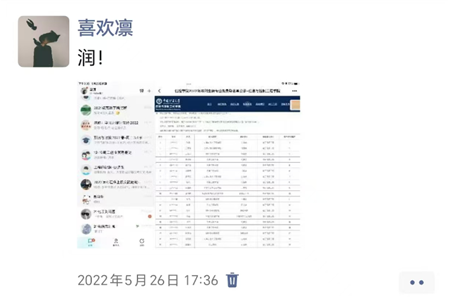
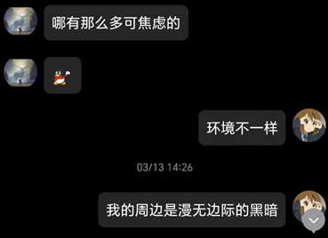
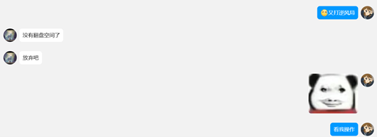
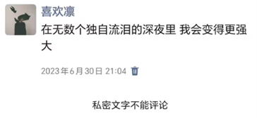
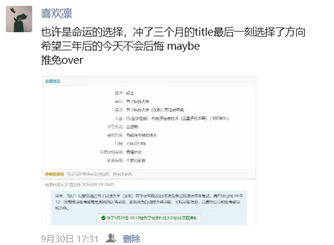
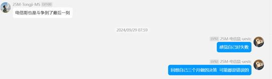

- [写在前面的话](#写在前面的话)
- [大一下转专业](#大一下转专业)
- [转专业遗留问题](#转专业遗留问题)
- [一次次满怀希望又一次次绝望的考试](#一次次满怀希望又一次次绝望的考试)
- [最后关头突然反悔的保研时刻](#最后关头突然反悔的保研时刻)

## 写在前面的话
老实说，我大一的时候根本没有考虑过保研的问题。高考进了能源与动力类专业之后，偶然在一位贴吧老哥的指点下，了解到了能动就业只能去电厂的这一事实，跟我所梦想的大都市、高薪、体面的工作相差甚远，因此萌生的转专业的念头  
喝了点小酒，思绪不一定清楚，下面以我大学的几个关键转折点来说说我的这三年吧。

## 大一下转专业
首先当时本来想转的是计算机专业，根据以往的政策和时间点，转专业在大二上进行，因此我大一下完全就是按部就班的准备（从这点也可以看出我最大的问题：拖延），结果大一下突然出台了新的转专业政策，打了我一个措手不及（其实当时给了两周时间，现在看来刷Leetcode完全来得及，这也体现出我第二个问题：面对巨大压力无法保持镇定），在转专业偶然听闻电子信息是一个小计算机，再加上本人高数不错，准备两天之后成功转入。  

## 转专业遗留问题
由于信控这边宿舍非常紧张（当时有三大院这种说法），根本没有转入的位置，再加上我们导员很摆（不愿意把转过去的学生换到一个宿舍），这就会导致一个严重的问题，我是一个人。这也是我贯穿我大二、大三生涯的核心问题，如何解决你一个人所存在的被孤立、被营造信息差的问题？这事关你能不能收到足够多的往年真题，这事关你是否能够完全了解考试的考点…  
我尝试过很多办法，都失败了，这也是我大学最遗憾的点之一吧，“我的周边是漫无边际的黑暗”。很多认识我的朋友对我都有一个共同的印象：急躁、带有强烈目的性，可能是因为我太害怕失败，可能是因为我太想成功了吧。  

## 一次次满怀希望又一次次绝望的考试
从大二下开始，我毫不怀疑的说，每次考试我都竭尽全力了。从7到11到16到19，在一次又一次的努力又失败的过程中，我直到现在才终于明白到受限于资源和有限的交流，我无法再做到创造奇迹了，像我之前那样；最后还是做不到吗？  
没有周围环境的支撑，我确实做不到，我终于明白我这三年所缺失最重要的东西，作为一个actor，我缺少合适的environment进行交互来优化我的下一步action，在reinforcement learning的体系中，我是一个永远不可能训练成功的机器人。  
  
  

## 最后关头突然反悔的保研时刻
最后也是最drama的时刻，现在回想起来很幽默也很有趣，心心念念的华科拿到了，title、位置都非常好的北理工也拿到了，甚至那边老师许诺我进所长所在的组，给很多学术资源，可以说我对我背景的利用程度还算比较高的，但是为什么会选择成电深呢？我自己也记不清我当时是怎么想的了，可能是命运的指引吧。  
    
    

再次感谢保研大家庭的群u们给我的指点，在此也非常感谢通信哥，对我的保研择校、目标定位、投递策略都给予了很多指导！！！
   
   
   

